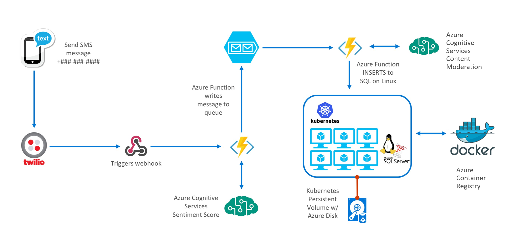

# SQL Guestbook
This is an example of a simple Guestbook registration process done via text messaging. Twilio processes the incoming text message and via a webhook, calls an Azure Function. Through a combination of Azure Functions, Queues and Cognitive Services, the incoming message is put through Cognitive Services Sentiment Analysis along with Content Moderation before being stored in SQL Server running on Linux inside of a Docker Container running on top of Kubernetes (K8s). The Guestbook list can then be viewed via an ASP.NET Core web front-end or Go web front-end also running as Containers on the same K8s cluster.



## Demo Pre-requisites

This application combines Azure Functions with Twilio, Azure Queues, Cognitive Services and posts data to databases such as Azure SQL or SQL Server on Linux running in a Container on Kubernetes. Below items must be setup in advance:

* Twilio account and setup: [Azure webhook details here](https://www.twilio.com/docs/guides/serverless-webhooks-azure-functions-and-csharp#create-a-new-azure-function-app)
* Azure Storage Queue
* Azure Container Services Kubernetes cluster
* Cognitive Services Account

## Setup Instructions

### Azure Functions

* Twilio trigger -> Azure Queue (ProcessTwilioWebHook)
  * Configure Azure Cognitive Text Analytics API
  * Configure Azure Cognitive Services Content Moderator
  * Provide URL and key in code (need to add to environment varible)
  * Bind to Azure Queue
* Azure Queue -> SQL Databases (SendToSQLFromQueue)
  * Parses data from Queue
  * Writes to SQL Azure or SQL on Linux depending on toggle flags in environment variables
    * SQL_AZURE_IP
    * SQL_AZURE_ID
    * SQL_AZURE_PWD
    * SQL_AZURE_DB
    * K8S_SQL_IP
    * K8S_SQL_ID
    * K8S_SQL_PWD
    * K8S_SQL_DB
    * TOGGLE_SQL_AZURE
    * TOGGLE_K8S_SQL

### Kubernetes deployments

#### Database

There are two options for the database. One is SQL Server running on Linux in a Container to demonstrate an example of persistence. The other option is full PaaS in the form of Azure SQL.

* Create new Azure SQL db called sql_guestbook

* Database is SQL Server running on Linux in K8s
- Image: microsoft/mssql-server-linux:2017-latest
- Kuberenetes example stores databases on Persistent Volume (Azure VHD)

```bash
# Replace GOES_HERE text before executing.
kubectl create -f kube-db.yaml
```

- Create SQL DB sql_guestbook. Suggest connecting to SQL with [mssql](https://docs.microsoft.com/en-us/sql/linux/sql-server-linux-develop-use-vscode) tool.

```sql
-- This step is necessary if using the SQL Server on Linux option.
CREATE DATABASE guestbookdb;

-- Create SQL table and add seed values.
USE guestbook;
CREATE TABLE guestlog (entrydate DATETIME, name NVARCHAR(30), phone NVARCHAR(30), message TEXT, sentiment_score NVARCHAR(30));
INSERT INTO guestlog VALUES ('2017-4-15 23:59:59', 'anonymous', '19192310925', 'That rug really tied the room together', '0.6625549');
```

#### .NET Web App

* Simple .NET web app that displays guestbook entries
* These web apps are in my Docker Hub account, but I suggest rebuilding using the included Dockerfiles and updating to your repo or hub. Sample commands are in web_app_go directory.
* Uses environment variables for SQL Server discovery

```bash
# Replace GOES_HERE text in file before executing.
kubectl create -f kube-dotnetweb.yaml
```

#### Go Web App

* Go version of the same web app

```bash
# Replace GOES_HERE text in file before executing.
kubectl create -f kube-goweb.yaml
```

#### Test Web Apps

* Find Public IPs and test both web apps to see if the seeded data is there.